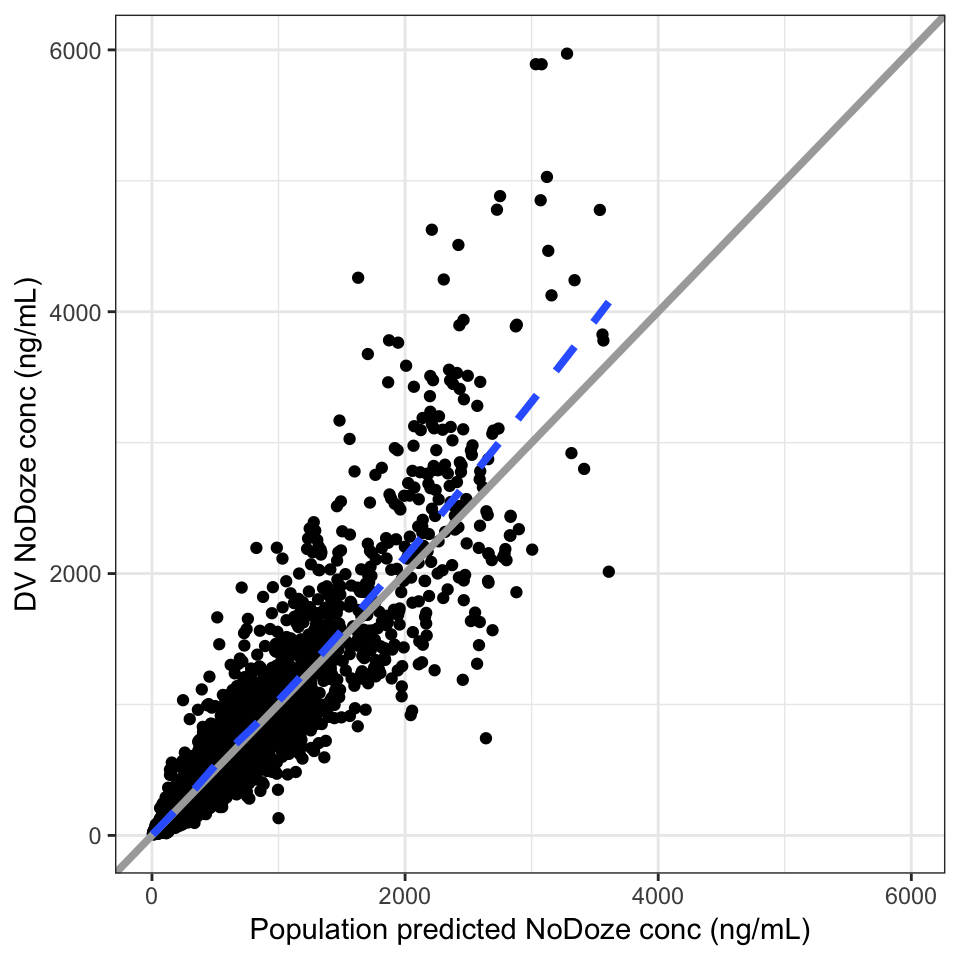
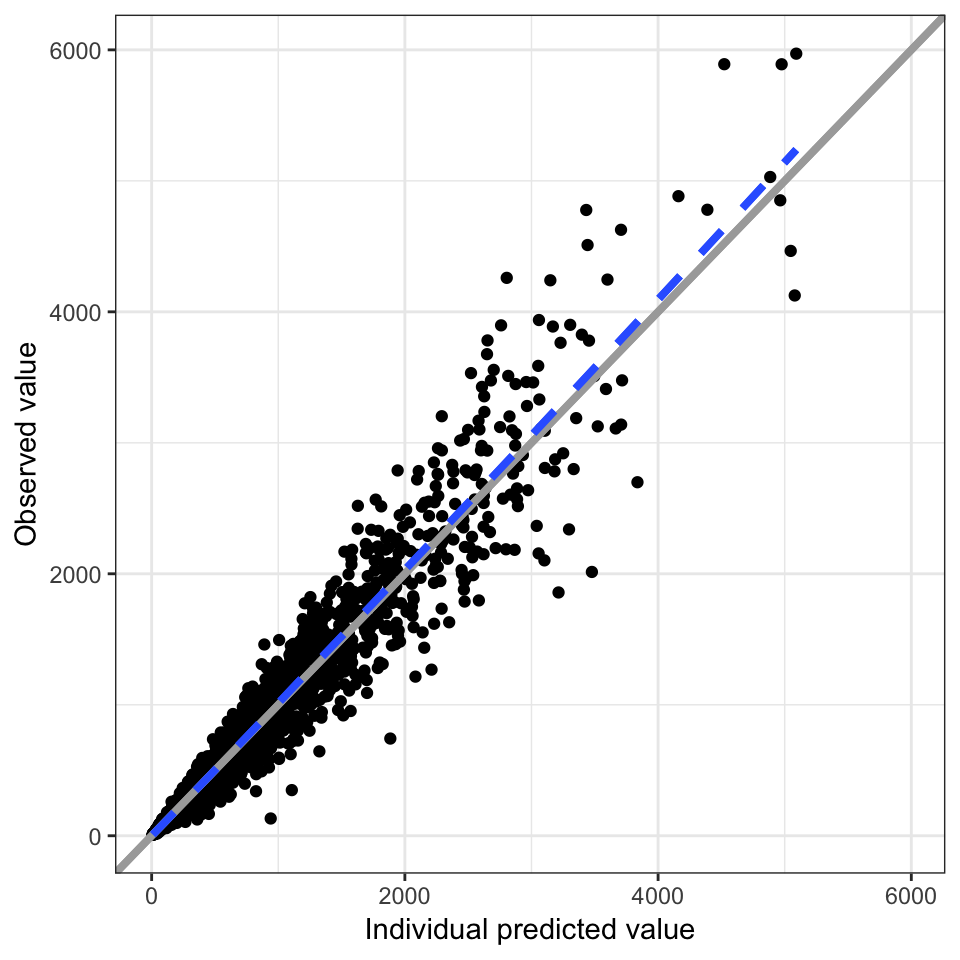
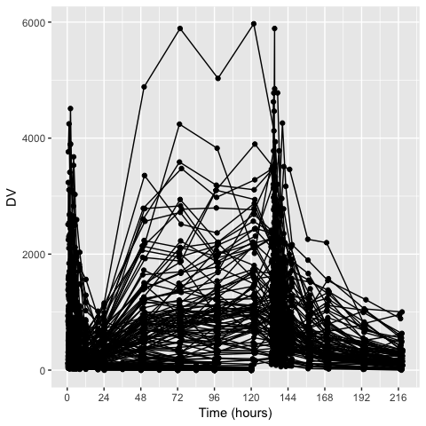
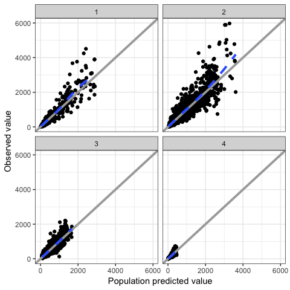
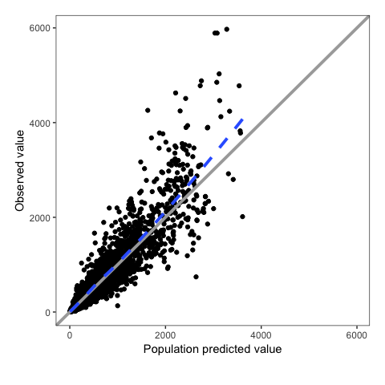
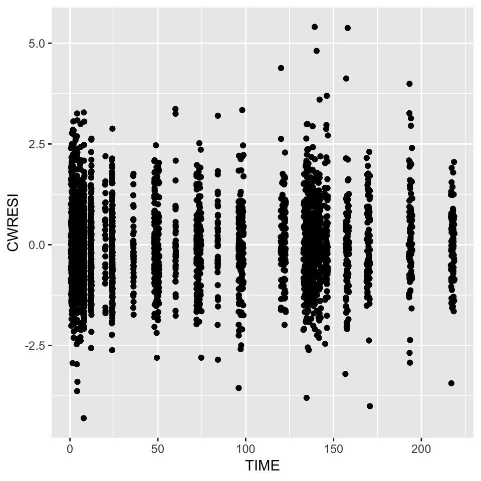
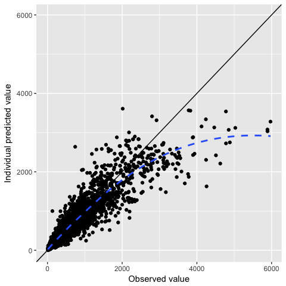
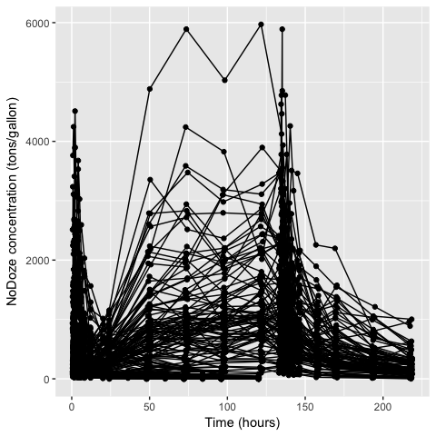

pmplots
================

-   [Introduction](#introduction)
-   [Default behavior](#default-behavior)
    -   [`col-label` format](#col-label-format)
-   [Customized plots](#customized-plots)
-   [Access pmplots look and feel](#access-pmplots-look-and-feel)
-   [Vectorized plots](#vectorized-plots)

Introduction
============

pmplots provides functions to create basic plots for pharmacometrics which share a common look and feel. The design is to provide one function to make one plot and the function is named according to the plot it generates.

Default behavior
================

For example, to make a plot of NPDE versus time, we call

``` r
npde_time(df)
```



A plot of DV versus IPRED would be

``` r
dv_ipred(df)
```



These functions assume defaults based on standard naming conventions. The intention is that, as far as it is possible, these functions are called with the data set as the single argument.

Where there are no obvious defaults, some functions require extra specification for the input data. For example, to make a pairs plot for etas, you would call

``` r
eta_pairs(df, c("ETA1//ETA-CL", "ETA2//ETA-V2"))
```



Or to plot CWRES versus weight

``` r
cwresi_cont(df, x = "WT//Weight (kg)")
```



`col-label` format
------------------

In the previous two examples, we had to identify both a column name to show where to find the input data as well as a column title or label to show what how to label the axis.

This is known as `col-label` format. In this format, we specify the column name separated by a double front slash (e.g. "WT//Weight").

Customized plots
================

Beyond the default behavior, we can also add some customization to our plots.

As a very basic example

``` r
cwresi_time(df, y = "CWRESI//CWRES")
```



Here, we override the default y-axis data and provide a custom name.

For the `_time` plots, we also have some arguments that can be invoked to customize the x-axis labels

``` r
cwresi_time(df, xby = 24)
```


Other customization can be made via the `xs` (x-axis) or `ys` (y-axis) arguments.

Access pmplots look and feel
============================

Sometimes you need to customize a plot so far that it is no longer possible to do with the built in functions. In this case, you should consider building a plot and using some of the helper functions included in pmplots to get the same look and feel.

For example, the basic plot might look like

``` r
p <- ggplot(df, aes(TIME,CWRESI)) + geom_point()

p
```



But we can style it to look like other plots in the pmplots package

``` r
p + pm_theme() + pm_hline() + pm_smooth() + facet_wrap(~STUDYc)
```



Vectorized plots
================

Frequently, we'd like to make a set of plots that are common, except for a single attribute. For example, we'd like to plot CWRES versus sevaral different covariates. We can do that by passing input in vector form. For example

``` r
library(mrggsave)

covariates <- c("WT", "CRCL", "ALB")

cwresi_cont(df, x = covariates, y = "CWRESI") %>% mrggpage() %>% mrggdraw()
```



In this example, we pass in the x values as a vector and we get a list of plots back. These plots can then be saved individually or (as shown in the example) arranged onto a single page.
