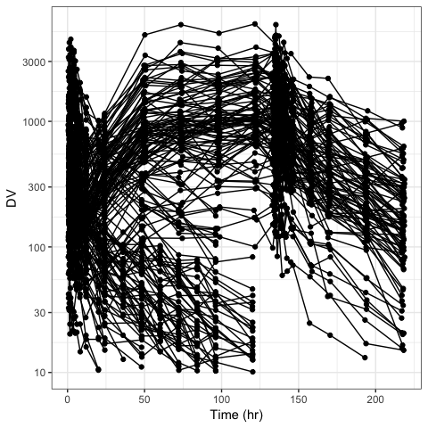
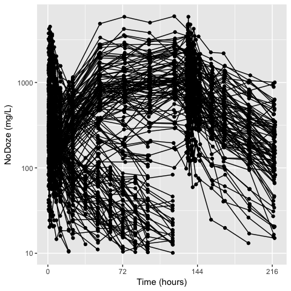

Table of contents
=================

-   [Basic functionality](#basics)
-   Other examples
    -   Complete listing: [everyfunction.md](inst/examples/everyfunction.md)
    -   Other examples: [example1.md](inst/examples/example1.md)

<a name="basics"></a>

Basics
======

Simple function calls
---------------------

``` r
dv_pred(df, what="NoDoze conc (ng/mL)")
```


Add a title
-----------

``` r
dv_time(df, title="Lookie here!")
```


Modify the axes
---------------

``` r
dv_time(df, xs=list(br=seq(0,240,24)))
```


``` r
dv_time(df, log=TRUE)
```



``` r
dv_time(df, what="NoDoze (mg/L)",
        ys = list(trans="log", breaks=logbr()),
        xs = list(br=seq(0,240,72)))
```



Some color support
------------------

``` r
dv_time(df, col="STUDYc")
```


Faceting
--------

``` r
dv_pred(df) + facet_wrap(~STUDY, ncol=2)
```


Add theme
---------

``` r
dv_pred(df) + theme_plain()
```


