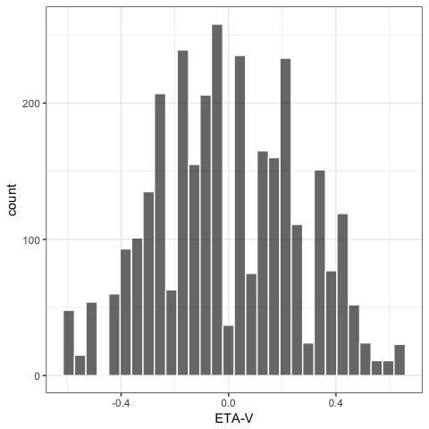
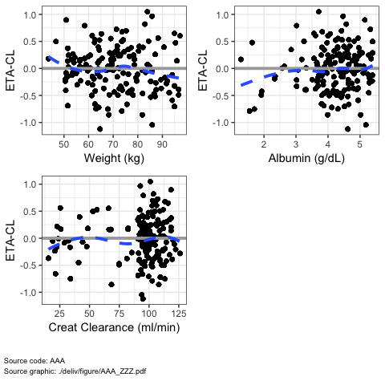
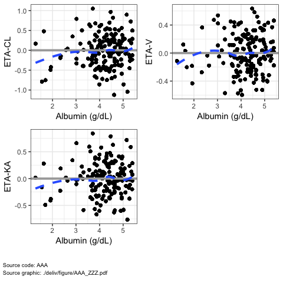
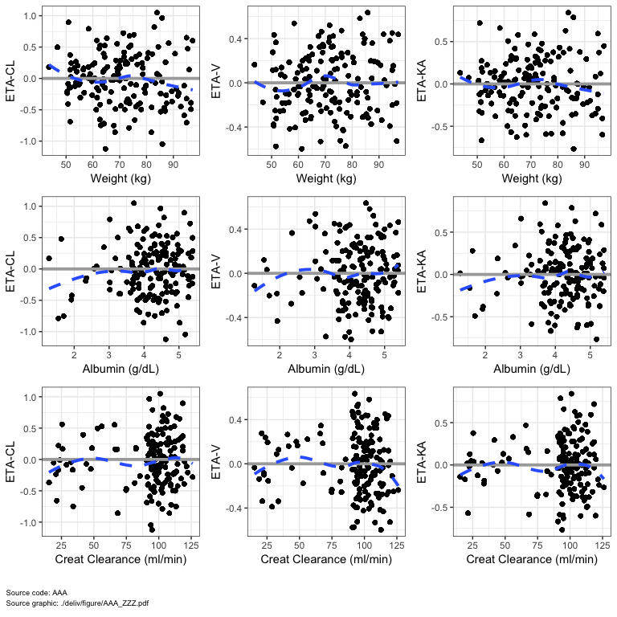

Vectorized Plotting Functions
================

-   [Most functions are not vectorized](#most-functions-are-not-vectorized)
-   [But some functions are vectorized](#but-some-functions-are-vectorized)
    -   [`eta_hist` is vectorized](#eta_hist-is-vectorized)
-   [Now more functions are vectorized](#now-more-functions-are-vectorized)
    -   [Vectorize over x-values](#vectorize-over-x-values)
    -   [Vectorize over y-values](#vectorize-over-y-values)
    -   [Vectorize over x-values and y-values](#vectorize-over-x-values-and-y-values)

``` r
knitr::opts_chunk$set(fig.path = "img/vectorized-", 
                      comment = '.', fig.width = 5, fig.height = 5)
```

``` r
library(pmplots)
library(mrggsave)
library(dplyr)
data <- pmplots_data_obs()
id <- pmplots_data_id()
```

Most functions are not vectorized
=================================

In this example, we just get back a single ggplot object

``` r
dv_time(data)
```


But some functions are vectorized
=================================

``` r
etas <- c("ETA1//ETA-CL", "ETA2//ETA-V", "ETA3//ETA-KA")
x <- eta_hist(data, etas)
```

``` r
is.list(x)
```

    . [1] TRUE

``` r
x[[2]]
```

    . `stat_bin()` using `bins = 30`. Pick better value with `binwidth`.



`eta_hist` is vectorized
------------------------

This function is vectorized because it takes a vector of eta indicators and returns a list of plots.

Now more functions are vectorized
=================================

Vectorize over x-values
-----------------------

For example, this is vectorized over the x values

``` r
covs <- c("WT//Weight (kg)", "ALB//Albumin (g/dL)", 
          "CRCL//Creat Clearance (ml/min)")

eta_cont(data, x = covs, y = etas[1]) %>% 
  mrggdraw(ncol = 2)
```



Vectorize over y-values
-----------------------

We can also vectorize over the y values

``` r
eta_cont(data, x = covs[2], y = etas) %>%
  mrggdraw(ncol = 2)
```



Vectorize over x-values and y-values
------------------------------------

First, the loop is across the x values, then the loop is across the y values

``` r
eta_cont(data, x = covs, y = etas) %>%
  mrggdraw(ncol = 3)
```


