Available functions
================

-   [Example data in the package](#example-data-in-the-package)
-   [`col//title` specification](#coltitle-specification)
-   [Observed vs predicted](#observed-vs-predicted)
    -   [Observed versus population predicted (`dv_pred`)](#observed-versus-population-predicted-dv_pred)
        -   [Observed versus population predicted - log/log](#observed-versus-population-predicted---loglog)
    -   [Observed versus individual predicted (`dv_ipred`)](#observed-versus-individual-predicted-dv_ipred)
        -   [Observed versus individual predicted - log/log](#observed-versus-individual-predicted---loglog)
        -   [Observed versus both PRED and IPRED](#observed-versus-both-pred-and-ipred)
-   [Residual plots](#residual-plots)
    -   [Residuals](#residuals)
        -   [Residuals versus time (`res_time`)](#residuals-versus-time-res_time)
        -   [Residuals versus time after first dose (`res_tafd`)](#residuals-versus-time-after-first-dose-res_tafd)
        -   [Residuals versus time after dose (`res_tad`)](#residuals-versus-time-after-dose-res_tad)
        -   [Residuals versus population predicted (`res_pred`)](#residuals-versus-population-predicted-res_pred)
        -   [RES versus continuous covariate (`res_cont`)](#res-versus-continuous-covariate-res_cont)
        -   [RES by categorical covariate (`res_cat`)](#res-by-categorical-covariate-res_cat)
        -   [Residual histogram (`res_hist`)](#residual-histogram-res_hist)
    -   [Weighted residuals](#weighted-residuals)
        -   [Weighted residuals versus time (`wres_time`)](#weighted-residuals-versus-time-wres_time)
        -   [Weighted residuals versus time after first dose (`wres_tafd`)](#weighted-residuals-versus-time-after-first-dose-wres_tafd)
        -   [Weighted residuals versus time after dose (`wres_tad`)](#weighted-residuals-versus-time-after-dose-wres_tad)
        -   [Weighted esiduals versus population predicted (`wres_pred`)](#weighted-esiduals-versus-population-predicted-wres_pred)
        -   [WRES versus continuous covariate (`wres_cont`)](#wres-versus-continuous-covariate-wres_cont)
        -   [WRES by categorical covariate (`wres_cat`)](#wres-by-categorical-covariate-wres_cat)
        -   [Weighted residual histogram (`wres_hist`)](#weighted-residual-histogram-wres_hist)
        -   [WRES QQ plot (`wres_q`)](#wres-qq-plot-wres_q)
    -   [Conditional weighted residuals (CWRES)](#conditional-weighted-residuals-cwres)
        -   [CWRES versus time (`cwres_time`)](#cwres-versus-time-cwres_time)
        -   [Conditional weighted residuals versus time after first dose (`cwres_tafd`)](#conditional-weighted-residuals-versus-time-after-first-dose-cwres_tafd)
        -   [CWRES versus time after dose (`cwres_tad`)](#cwres-versus-time-after-dose-cwres_tad)
        -   [CWRES versus continuous covariate (`cwres_cont`)](#cwres-versus-continuous-covariate-cwres_cont)
        -   [CWRES by categorical covariate (`cwres_cat`)](#cwres-by-categorical-covariate-cwres_cat)
        -   [Conditional weighted residual histogram (`cwres_hist`)](#conditional-weighted-residual-histogram-cwres_hist)
        -   [CWRES versus population predicted (`cwres_pred`)](#cwres-versus-population-predicted-cwres_pred)
        -   [CWRES QQ plot (`cwres_q`)](#cwres-qq-plot-cwres_q)
-   [NPDE plots](#npde-plots)
    -   [NPDE versus TIME (`npde_time`, `npde_tad`, `npde_tafd`)](#npde-versus-time-npde_time-npde_tad-npde_tafd)
    -   [NPDE versus TAD (`npde_tad`)](#npde-versus-tad-npde_tad)
    -   [NPDE versus TAFD (`npde_tafd`)](#npde-versus-tafd-npde_tafd)
    -   [NPDE versus PRED (`npde_pred`)](#npde-versus-pred-npde_pred)
    -   [QQ-plot with NPDE (`npde_q`)](#qq-plot-with-npde-npde_q)
    -   [NPDE histogram (`npde_hist`)](#npde-histogram-npde_hist)
-   [ETA plots](#eta-plots)
    -   [ETA versus continuous covariates (`eta_cont`)](#eta-versus-continuous-covariates-eta_cont)
        -   [Grouped by eta](#grouped-by-eta)
        -   [Grouped by covariate](#grouped-by-covariate)
    -   [ETA by categorical covariates (`eta_cat`)](#eta-by-categorical-covariates-eta_cat)
    -   [ETA histograms (`eta_hist`)](#eta-histograms-eta_hist)
    -   [ETA pairs plot (`eta_pairs`)](#eta-pairs-plot-eta_pairs)
-   [DV versus time (`dv_time`)](#dv-versus-time-dv_time)
    -   [Basic plot](#basic-plot)
    -   [Faceted](#faceted)
    -   [log-Scale](#log-scale)
-   [Data summary](#data-summary)
    -   [Continuous variable by categorical variable (`cont_cat`)](#continuous-variable-by-categorical-variable-cont_cat)
    -   [General histogram (`cont_hist`)](#general-histogram-cont_hist)
    -   [Split and plot (`split_plot`)](#split-and-plot-split_plot)
-   [Some customization](#some-customization)
    -   [Modify x-axis](#modify-x-axis)
    -   [Modify y-axis](#modify-y-axis)
    -   [Drop extra layers](#drop-extra-layers)
    -   [Custom breaks](#custom-breaks)
    -   [Extra reference lines to \[C\]WRES plots](#extra-reference-lines-to-cwres-plots)

``` r
library(pmplots)
library(dplyr)
library(mrggsave)
library(purrr)
```

Example data in the package
===========================

``` r
df <- pmplots_data() %>% filter(EVID==0,!is.na(PRED)) %>% mutate(CWRES = CWRESI)

id <- distinct(df, ID, .keep_all=TRUE)

dayx <- defx(breaks = seq(0,168,24))
.yname <- "NoDoz (ng/mL)"

etas <- c("ETA1//ETA-CL", "ETA2//ETA-V2", "ETA3//ETA-KA")
covs <- c("WT//Weight (kg)", "ALB//Albumin (g/dL)", "SCR//Creatinine (mg/dL)")
```

Override the `df` and `id` objects in the above chunk

``` r
## Nothing here
```

`col//title` specification
==========================

This is a way to specify the column name for source data along with the axis label col\_label("CL//Clearance (L)")

Observed vs predicted
=====================

Observed versus population predicted (`dv_pred`)
------------------------------------------------

``` r
dv_pred(df, yname = .yname)
```

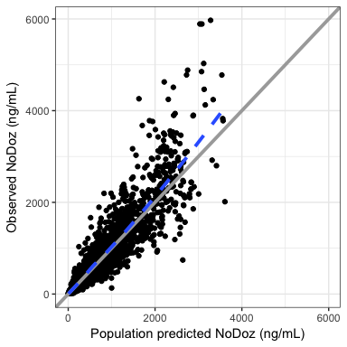

### Observed versus population predicted - log/log

``` r
dv_pred(df, loglog=TRUE, yname = .yname)
```

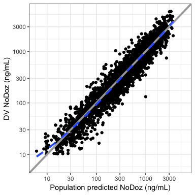

Observed versus individual predicted (`dv_ipred`)
-------------------------------------------------

``` r
dv_ipred(df, yname=.yname)
```

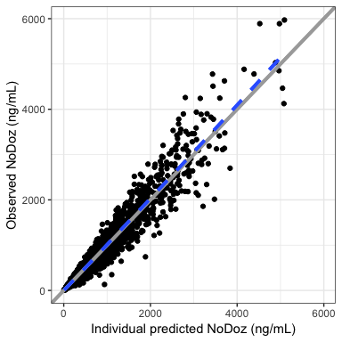

### Observed versus individual predicted - log/log

``` r
dv_ipred(df, loglog=TRUE, yname = .yname)
```

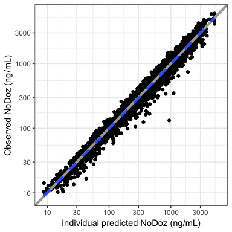

### Observed versus both PRED and IPRED

``` r
dv_preds(df) %>% mrggdraw(ncol = 2)
```

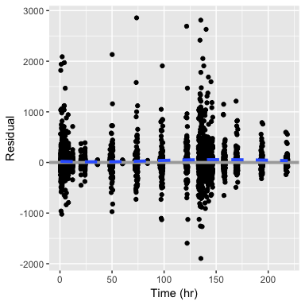

Residual plots
==============

Residuals
---------

### Residuals versus time (`res_time`)

``` r
res_time(df)
```

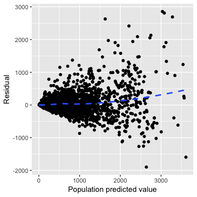

### Residuals versus time after first dose (`res_tafd`)

``` r
res_tafd(df)
```

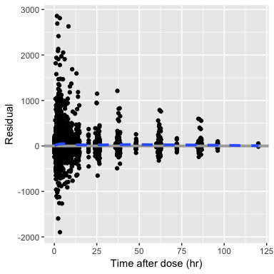

### Residuals versus time after dose (`res_tad`)

``` r
res_tad(df)
```

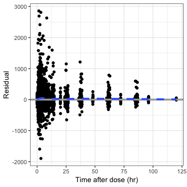

### Residuals versus population predicted (`res_pred`)

``` r
res_pred(df)
```

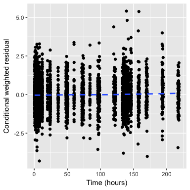

### RES versus continuous covariate (`res_cont`)

``` r
res_cont(df, x="WT//Weight (kg)")
```

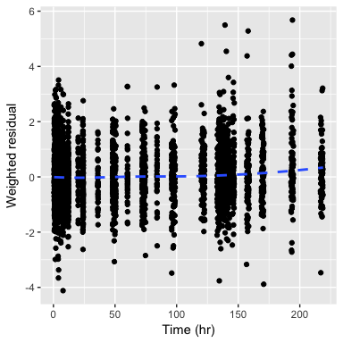

This function is also vectorized in x.

``` r
c("WT", "CRCL", "AST") %>% map(.f = partial(res_cont,df)) %>% mrggpage %>% mrggdraw
```

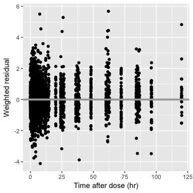

### RES by categorical covariate (`res_cat`)

``` r
dplyr::count(df, STUDYc)
```

    . # A tibble: 4 x 2
    .   STUDYc      n
    .   <fct>   <int>
    . 1 SAD       424
    . 2 MAD      1199
    . 3 Renal     960
    . 4 Hepatic   559

``` r
res_cat(df, x="STUDYc//Study type")
```

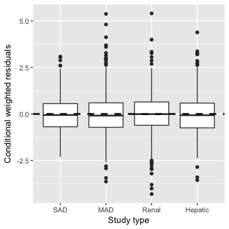

### Residual histogram (`res_hist`)

``` r
res_hist(df)
```

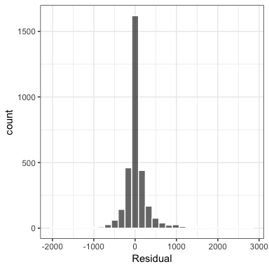

Weighted residuals
------------------

### Weighted residuals versus time (`wres_time`)

``` r
wres_time(df) 
```

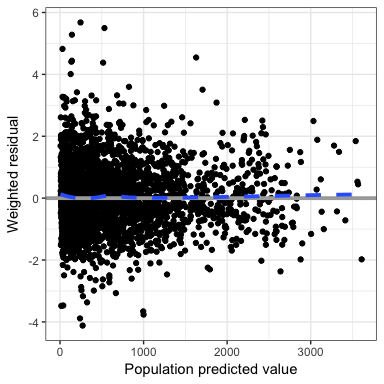

### Weighted residuals versus time after first dose (`wres_tafd`)

``` r
wres_tafd(df)
```

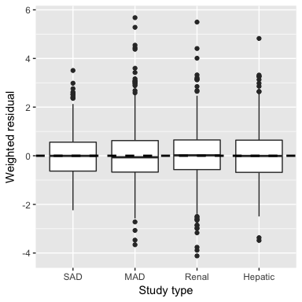

### Weighted residuals versus time after dose (`wres_tad`)

``` r
wres_tad(df)
```

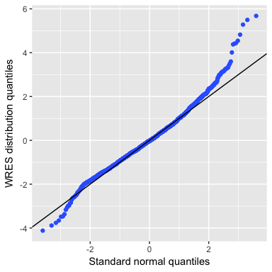

### Weighted esiduals versus population predicted (`wres_pred`)

``` r
wres_pred(df)
```

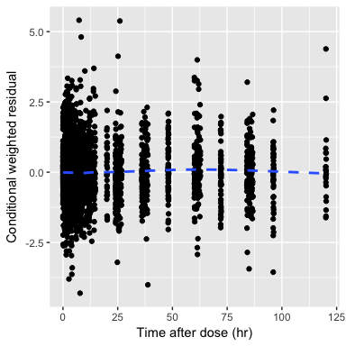

### WRES versus continuous covariate (`wres_cont`)

This function is also vectorized in x.

``` r
wres_cont(df, x="WT//Weight (kg)")
```


### WRES by categorical covariate (`wres_cat`)

``` r
wres_cat(df, x="STUDYc//Study type")
```

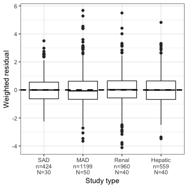

### Weighted residual histogram (`wres_hist`)

``` r
wres_hist(df)
```

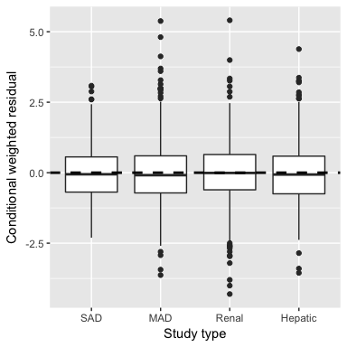

### WRES QQ plot (`wres_q`)

``` r
wres_q(df)
```

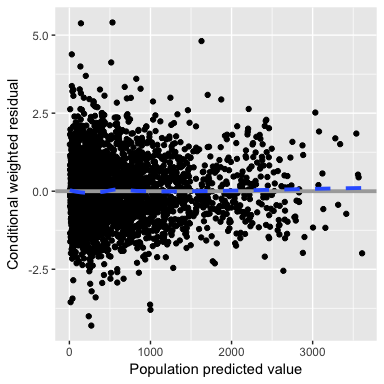

Conditional weighted residuals (CWRES)
--------------------------------------

### CWRES versus time (`cwres_time`)

``` r
cwres_time(df)
```


### Conditional weighted residuals versus time after first dose (`cwres_tafd`)

``` r
cwres_tafd(df)
```

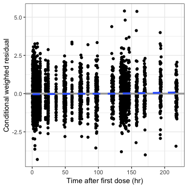

### CWRES versus time after dose (`cwres_tad`)

``` r
cwres_tad(df)
```

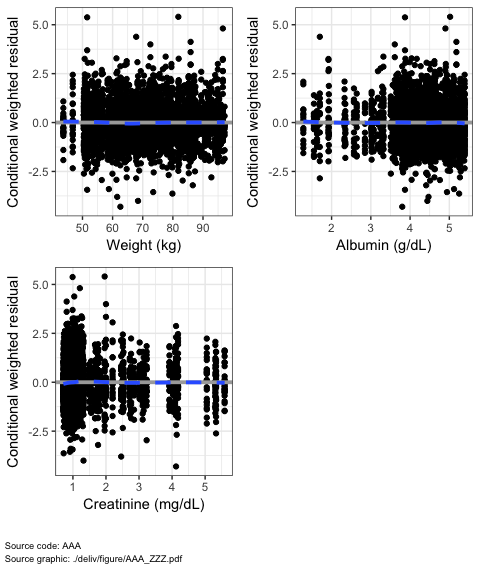

### CWRES versus continuous covariate (`cwres_cont`)

``` r
cwres_cont(df, x="WT//Weight (kg)")
```

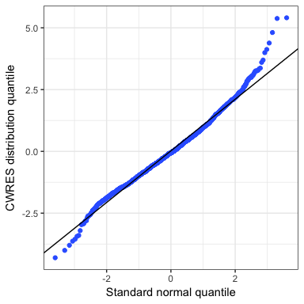

Vectorized version

``` r
cwres_cont(df, covs) %>% 
  mrggdraw(ncol = 2)
```

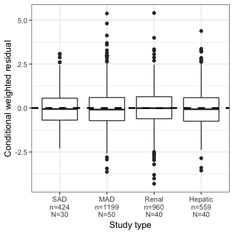

### CWRES by categorical covariate (`cwres_cat`)

``` r
cwres_cat(df, x="STUDYc//Study type")
```

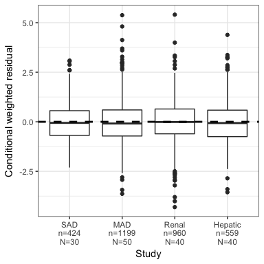

``` r
cwres_cat(df, x="STUDYc//Study type", shown=FALSE)
```

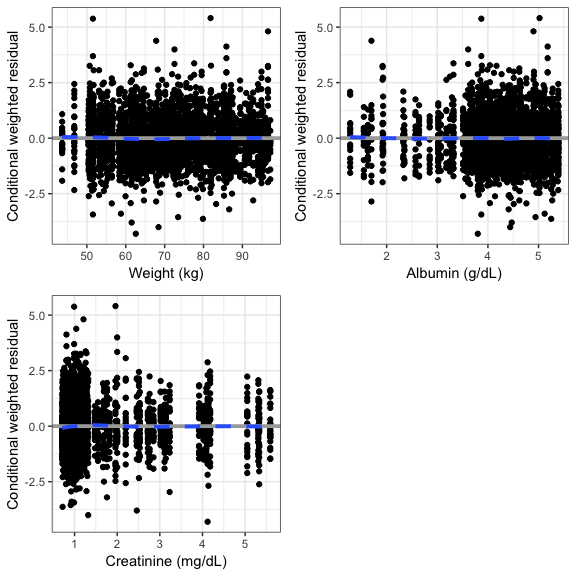

Vectorized version

``` r
cwres_cat(df, x = c("STUDYc//Study", "RF//Renal Function"))
```

    . [[1]]

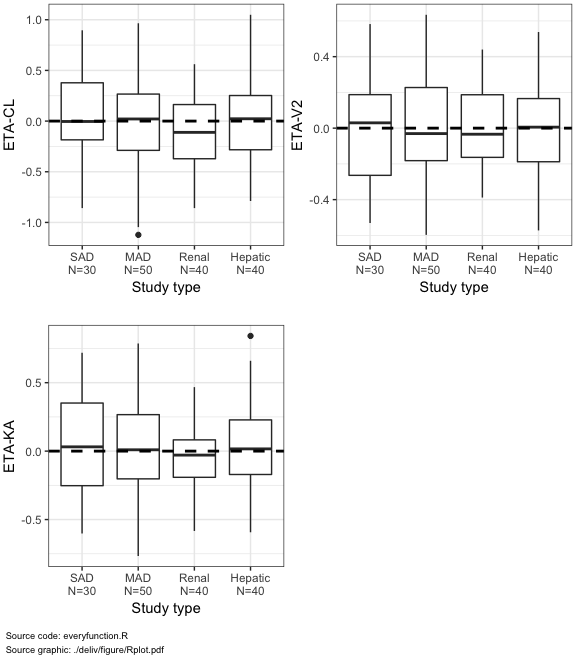

    . 
    . [[2]]


### Conditional weighted residual histogram (`cwres_hist`)

``` r
cwres_hist(df)
```

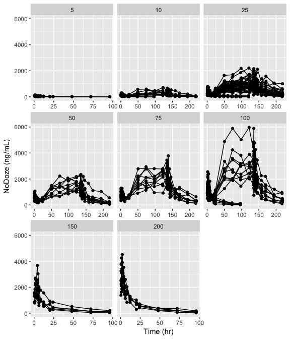

### CWRES versus population predicted (`cwres_pred`)

``` r
cwres_pred(df)
```

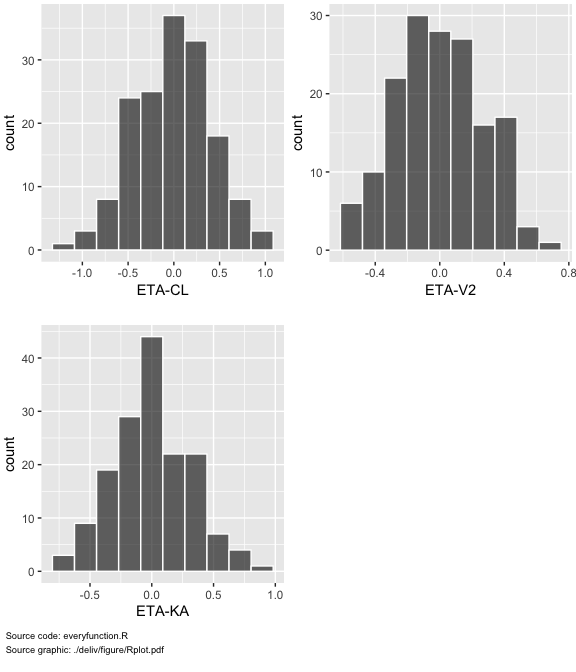

### CWRES QQ plot (`cwres_q`)

``` r
cwres_q(df)
```

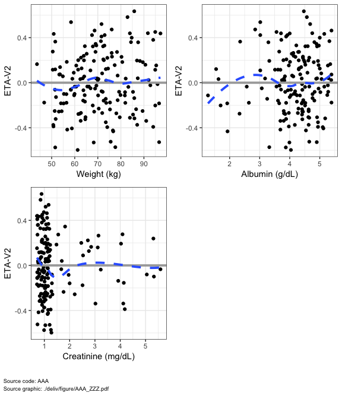

NPDE plots
==========

NPDE versus TIME (`npde_time`, `npde_tad`, `npde_tafd`)
-------------------------------------------------------

``` r
npde_time(df)
```

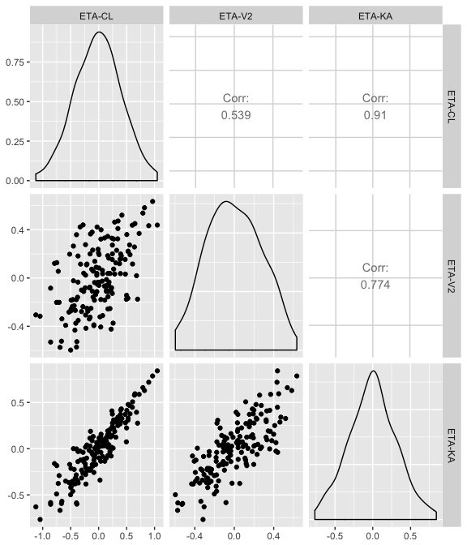

NPDE versus TAD (`npde_tad`)
----------------------------

``` r
npde_tad(df)
```

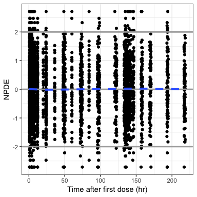

NPDE versus TAFD (`npde_tafd`)
------------------------------

``` r
npde_tafd(df)
```

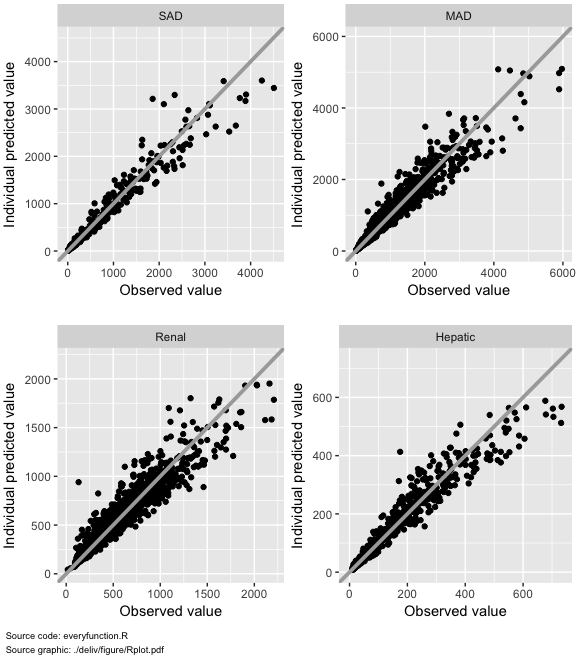

NPDE versus PRED (`npde_pred`)
------------------------------

``` r
npde_pred(df)
```

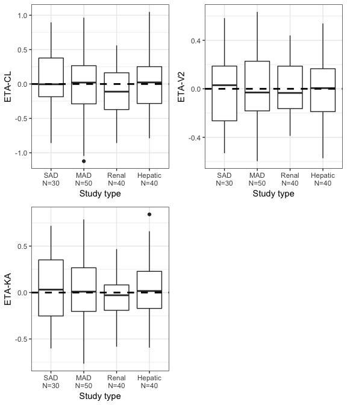

QQ-plot with NPDE (`npde_q`)
----------------------------

``` r
npde_q(df)
```

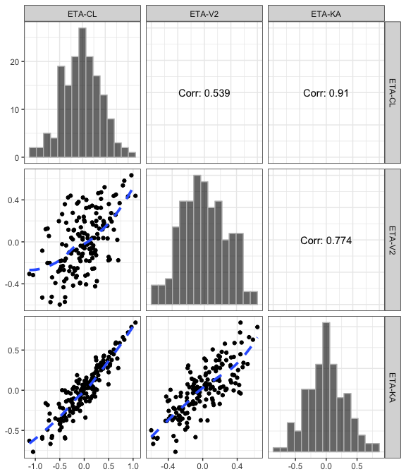

NPDE histogram (`npde_hist`)
----------------------------

``` r
npde_hist(df)
```

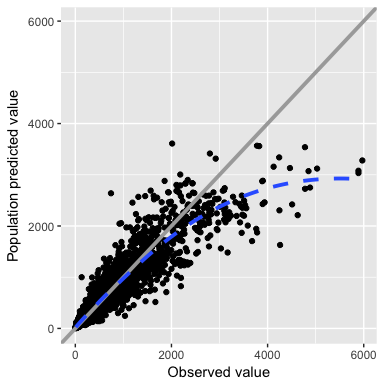

ETA plots
=========

``` r
etas <- c("ETA1//ETA-CL", "ETA2//ETA-V2", "ETA3//ETA-KA")
covs <- c("WT//Weight (kg)", "ALB//Albumin (g/dL)", "SCR//Creatinine (mg/dL)")
```

ETA versus continuous covariates (`eta_cont`)
---------------------------------------------

### Grouped by eta

``` r
eta_cont(id, x=covs,y=etas[2]) %>% 
  mrggdraw(ncol = 2)
```

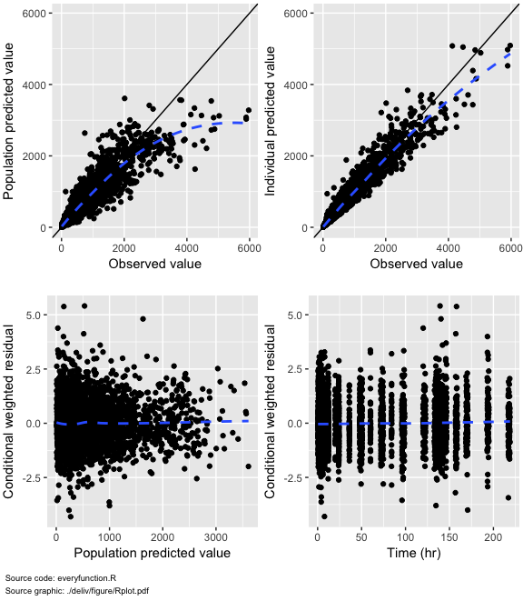

### Grouped by covariate

``` r
eta_cont(id, x=covs[1], y=etas) %>%
  mrggdraw(ncol = 2)
```

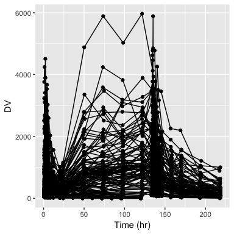

ETA by categorical covariates (`eta_cat`)
-----------------------------------------

``` r
p <- eta_cat(id, x="STUDYc//Study type", y=etas)
```

``` r
mrggdraw(p, ncol=2, arrange=TRUE, script="everyfunction.R")
```

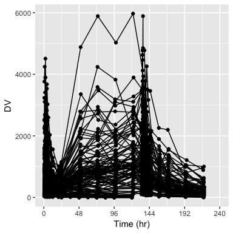

ETA histograms (`eta_hist`)
---------------------------

``` r
etas <- c("ETA1//ETA-CL", "ETA2//ETA-V2", "ETA3//ETA-KA")
p <- eta_hist(id,etas, bins=10)
```

``` r
mrggdraw(p, ncol=2, arrange=TRUE, script="everyfunction.R")
```

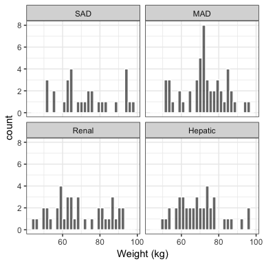

ETA pairs plot (`eta_pairs`)
----------------------------

``` r
p <- eta_pairs(id,etas)
```

``` r
print(p)
```

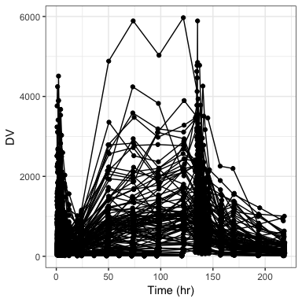

DV versus time (`dv_time`)
==========================

Basic plot
----------

``` r
dv_time(df, yname = .yname)
```


Faceted
-------

``` r
dv_time(df, yname="NoDoze (ng/mL)") +
  facet_wrap(~DOSE, scales="free_x")
```


log-Scale
---------

``` r
dv_time(df, yname="NoDoze (ng/mL)", log=TRUE) +
  facet_wrap(~STUDYc)
```

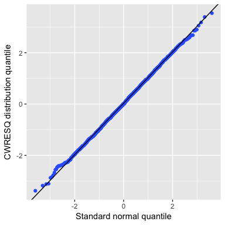

Data summary
============

Continuous variable by categorical variable (`cont_cat`)
--------------------------------------------------------

``` r
cont_cat(id, x="STUDYc", y="WT")
```

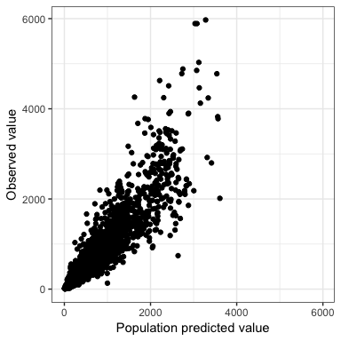

General histogram (`cont_hist`)
-------------------------------

``` r
cont_hist(id, x = "WT", bins = 20)
```

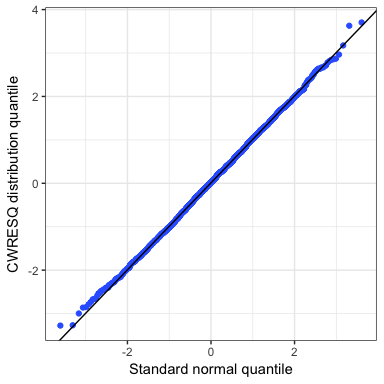

Split and plot (`split_plot`)
-----------------------------

``` r
p <- split_plot(df, sp="STUDYc", fun=dv_ipred)
```

``` r
mrggdraw(p, ncol = 2)
```

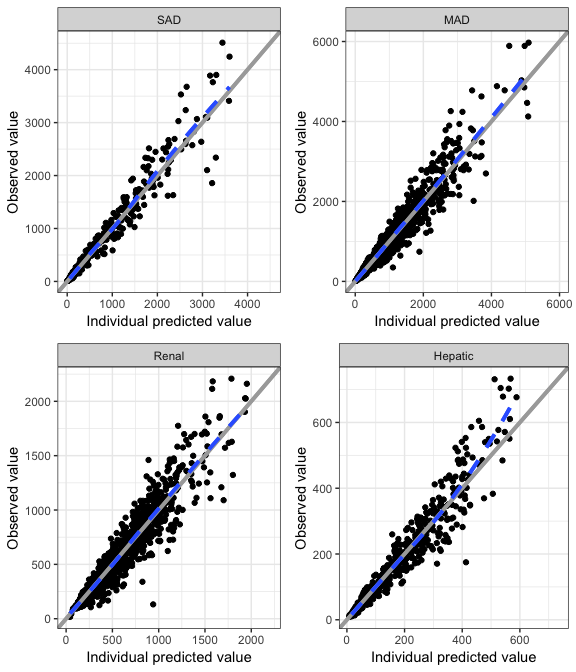

Some customization
==================

Modify x-axis
-------------

``` r
a <- list(trans="log", breaks = logbr3())

dv_time(df, xs=a)
```

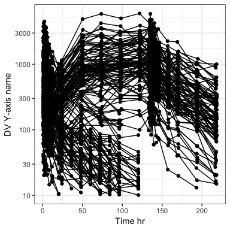

Modify y-axis
-------------

``` r
dv_time(df, ys=a, yname="Y-axis name")
```

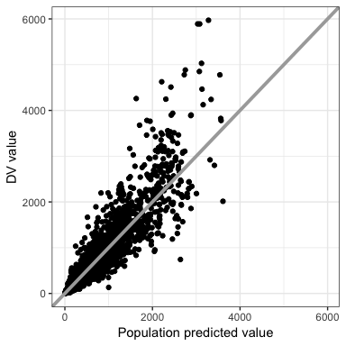

Drop extra layers
-----------------

``` r
dv_pred(df, smooth=NULL)
```

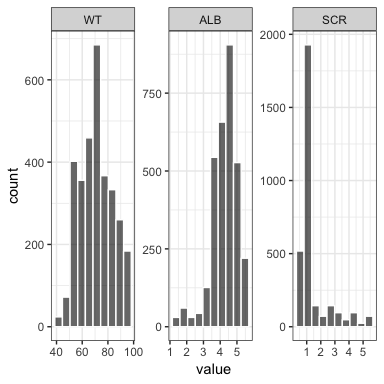

``` r
dv_pred(df, abline=NULL)
```

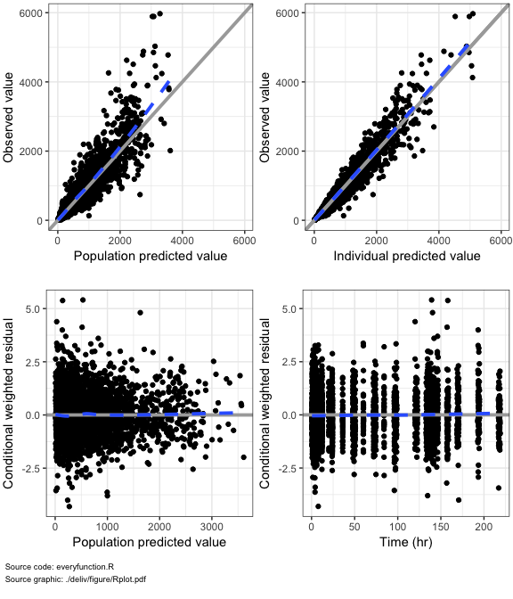

``` r
dv_pred(df, abline=NULL, smooth = NULL)
```

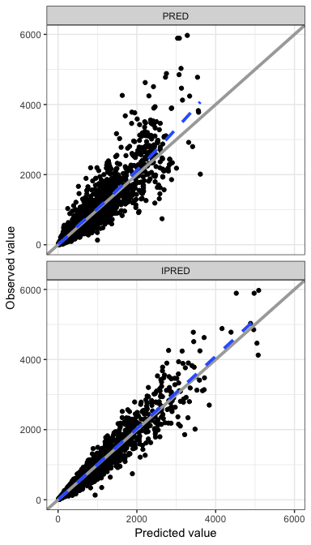

``` r
cwres_time(df, hline = NULL)
```


Custom breaks
-------------

Default breaks:

``` r
dv_time(df)
```


Break every 3 days

``` r
dv_time(df, xby=72)
```


Custom breaks and limits

``` r
a <- list(br = seq(0,240,48), limits=c(0,240))
dv_time(df, xs=a)
```


Extra reference lines to \[C\]WRES plots
----------------------------------------

``` r
wres_time(df) + geom_3s()
```


