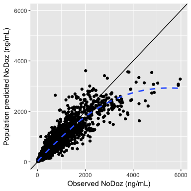
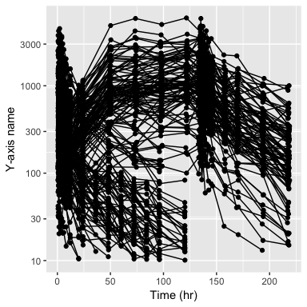

Available functions
================

-   [Example data in the package](#example-data-in-the-package)
-   [`col//title` specification](#coltitle-specification)
-   [Observed vs predicted](#observed-vs-predicted)
    -   [Observed versus population predicted (`dv_pred`)](#observed-versus-population-predicted-dv_pred)
        -   [Observed versus population predicted - log/log](#observed-versus-population-predicted---loglog)
    -   [Observed versus individual predicted (`dv_ipred`)](#observed-versus-individual-predicted-dv_ipred)
        -   [Observed versus individual predicted - log/log](#observed-versus-individual-predicted---loglog)
-   [Residual plots](#residual-plots)
    -   [Residuals](#residuals)
        -   [Residuals versus time (`res_time`)](#residuals-versus-time-res_time)
        -   [Residuals versus time after dose (`res_tad`)](#residuals-versus-time-after-dose-res_tad)
        -   [Residuals versus population predicted (`res_pred`)](#residuals-versus-population-predicted-res_pred)
        -   [RES versus continuous covariate (`res_cont`)](#res-versus-continuous-covariate-res_cont)
        -   [RES by categorical covariate (`res_cat`)](#res-by-categorical-covariate-res_cat)
    -   [Weighted residuals](#weighted-residuals)
        -   [Weighted residuals versus time (`wres_time`)](#weighted-residuals-versus-time-wres_time)
        -   [Weighted residuals versus time after dose (`wres_tad`)](#weighted-residuals-versus-time-after-dose-wres_tad)
        -   [Weighted esiduals versus population predicted (`wres_pred`)](#weighted-esiduals-versus-population-predicted-wres_pred)
        -   [WRES versus continuous covariate (`wres_cont`)](#wres-versus-continuous-covariate-wres_cont)
        -   [WRES by categorical covariate (`wres_cat`)](#wres-by-categorical-covariate-wres_cat)
        -   [WRES QQ plot (`wres_q`)](#wres-qq-plot-wres_q)
    -   [Conditional weighted residuals (CWRES)](#conditional-weighted-residuals-cwres)
        -   [CWRES versus time (`cwres_time`)](#cwres-versus-time-cwres_time)
        -   [CWRES versus time after dose (`cwres_tad`)](#cwres-versus-time-after-dose-cwres_tad)
        -   [CWRES versus continuous covariate (`cwres_cont`)](#cwres-versus-continuous-covariate-cwres_cont)
        -   [CWRES by categorical covariate (`cwres_cat`)](#cwres-by-categorical-covariate-cwres_cat)
        -   [CWRES versus population predicted (`cwres_pred`)](#cwres-versus-population-predicted-cwres_pred)
        -   [CWRES QQ plot (`cwres_q`)](#cwres-qq-plot-cwres_q)
-   [ETA plots](#eta-plots)
    -   [ETA versus continuous covariates (`eta_cont`)](#eta-versus-continuous-covariates-eta_cont)
    -   [ETA by categorical covariates (`eta_cat`)](#eta-by-categorical-covariates-eta_cat)
    -   [ETA histograms (`eta_hist`)](#eta-histograms-eta_hist)
-   [DV versus time (`dv_time`)](#dv-versus-time-dv_time)
    -   [Basic plot](#basic-plot)
    -   [Faceted](#faceted)
    -   [Colored](#colored)
    -   [log-Scale](#log-scale)
-   [Data summary](#data-summary)
    -   [Continuous variable by categorical variable (`cont_cat`)](#continuous-variable-by-categorical-variable-cont_cat)
    -   [Split and plot (`split_plot`)](#split-and-plot-split_plot)
-   [Plot output (`mrggsave`)](#plot-output-mrggsave)
    -   [Saving single plots](#saving-single-plots)
    -   [Save multiple plots to one file](#save-multiple-plots-to-one-file)
    -   [Arrange multiple plots on a single page](#arrange-multiple-plots-on-a-single-page)

``` r
library(pmplots)
library(dplyr)
```

Example data in the package
===========================

``` r
df <- superset2() %>% filter(EVID==0)

id <- distinct(df, ID, .keep_all=TRUE)

dayx <- defx(breaks = seq(0,168,24))
.yname <- "NoDoz (ng/mL)"
```

`col//title` specification
==========================

This is a way to specify the column name for source data along with the axis label col\_label("CL//Clearance (L)")

Observed vs predicted
=====================

Observed versus population predicted (`dv_pred`)
------------------------------------------------

``` r
dv_pred(df, yname = .yname)
```



### Observed versus population predicted - log/log

``` r
dv_pred(df,loglog=TRUE, yname = .yname)
```


Observed versus individual predicted (`dv_ipred`)
-------------------------------------------------

``` r
dv_ipred(df, what=.what)
```


### Observed versus individual predicted - log/log

``` r
dv_ipred(df, loglog=TRUE, yname = .yname)
```


Residual plots
==============

Residuals
---------

### Residuals versus time (`res_time`)

``` r
res_time(df)
```


### Residuals versus time after dose (`res_tad`)

``` r
res_tad(df)
```


### Residuals versus population predicted (`res_pred`)

``` r
res_pred(df)
```


### RES versus continuous covariate (`res_cont`)

``` r
res_cont(df, x="WT//Weight (kg)")
```


### RES by categorical covariate (`res_cat`)

``` r
res_cat(df, x="STUDYc//Study type")
```


Weighted residuals
------------------

### Weighted residuals versus time (`wres_time`)

``` r
wres_time(df) 
```


### Weighted residuals versus time after dose (`wres_tad`)

``` r
wres_tad(df)
```


### Weighted esiduals versus population predicted (`wres_pred`)

``` r
wres_pred(df)
```


### WRES versus continuous covariate (`wres_cont`)

``` r
wres_cont(df, x="WT//Weight (kg)")
```


### WRES by categorical covariate (`wres_cat`)

``` r
wres_cat(df, x="STUDYc//Study type")
```


### WRES QQ plot (`wres_q`)

``` r
wres_q(df)
```


Conditional weighted residuals (CWRES)
--------------------------------------

### CWRES versus time (`cwres_time`)

``` r
cwres_time(df)
```


### CWRES versus time after dose (`cwres_tad`)

``` r
cwres_tad(df)
```


### CWRES versus continuous covariate (`cwres_cont`)

``` r
cwres_cont(df, x="WT//Weight (kg)")
```


### CWRES by categorical covariate (`cwres_cat`)

``` r
cwres_cat(df, x="STUDYc//Study type")
```


``` r
cwres_cat(df, x="STUDYc//Study type", shown=FALSE)
```


### CWRES versus population predicted (`cwres_pred`)

``` r
cwres_pred(df)
```


### CWRES QQ plot (`cwres_q`)

``` r
cwres_q(df)
```


ETA plots
=========

ETA versus continuous covariates (`eta_cont`)
---------------------------------------------

``` r
etas <- c("ETA1//ETA-CL", "ETA2//ETA-V2", "ETA3//ETA-KA")
p <- eta_cont(df, x="WT//Weight (kg)",y=etas)
```

``` r
mrggdraw(p, ncol=2, arrange=TRUE, script="everyfunction.R")
```


ETA by categorical covariates (`eta_cat`)
-----------------------------------------

``` r
p <- eta_cat(df, x="STUDYc//Study type", y=etas)
```

``` r
mrggdraw(p, ncol=2, arrange=TRUE, script="everyfunction.R")
```


ETA histograms (`eta_hist`)
---------------------------

``` r
etas <- c("ETA1//ETA-CL", "ETA2//ETA-V2", "ETA3//ETA-KA")
p <- eta_hist(df,etas, bins=10)
```

``` r
mrggdraw(p, ncol=2, arrange=TRUE, script="everyfunction.R")
```


DV versus time (`dv_time`)
==========================

Basic plot
----------

``` r
dv_time(df, yname = .yname)
```


Faceted
-------

``` r
dv_time(df, yname="NoDoze (ng/mL)") +
  facet_wrap(~DOSE, scales="free_x")
```


Colored
-------

``` r
dv_time(df, yname="NoDoze (ng/mL)", col="STUDYc") +
  facet_wrap(~DOSE, scales="free")
```


log-Scale
---------

``` r
dv_time(df, yname="NoDoze (ng/mL)", log=TRUE) +
  facet_wrap(~STUDYc)
```


Data summary
============

Continuous variable by categorical variable (`cont_cat`)
--------------------------------------------------------

``` r
cont_cat(df, x="STUDYc//Study name", y="WT//Weight (kg)")
```


Split and plot (`split_plot`)
-----------------------------

``` r
p <- split_plot(df, sp="STUDYc", fun=dv_ipred)
```

``` r
mrggdraw(p, arrange=TRUE, script="everyfunction.R")
```


Plot output (`mrggsave`)
========================

Saving single plots
-------------------

``` r
p1 <- dv_pred(df)
```

``` r
mrggsave(p1, script="everyfunction.R", stem="figure1")
```

Save multiple plots to one file
-------------------------------

``` r
p2 <- dv_ipred(df)
p3 <- cwres_pred(df)
p4 <- cwres_time(df)
```

``` r
mrggsave(list(p1,p2,p3,p4), script="everyfunction.R", stem="figure1")
```

Arrange multiple plots on a single page
---------------------------------------

``` r
mrggdraw(list(p1,p2,p3,p4), arrange=TRUE, script="everyfunction.R")
```


