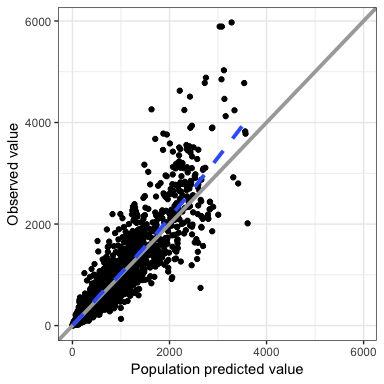
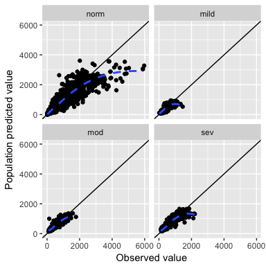
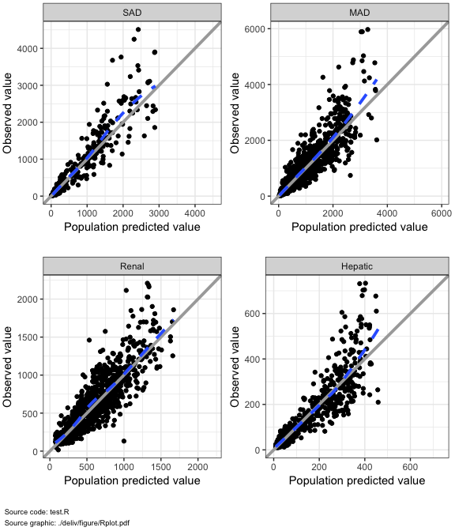
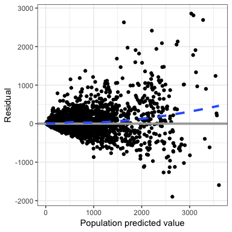
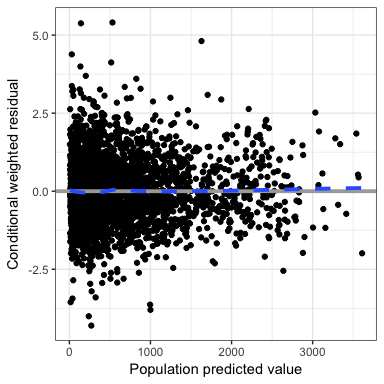
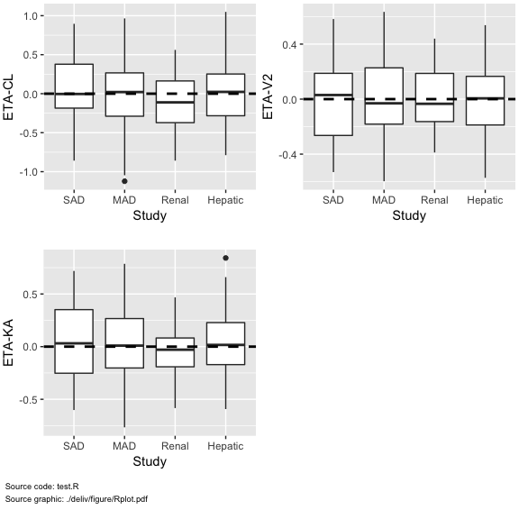
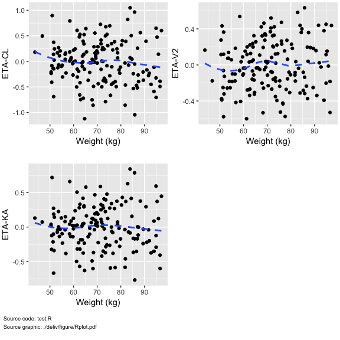
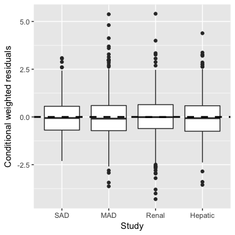
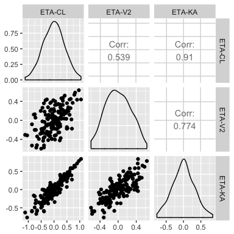
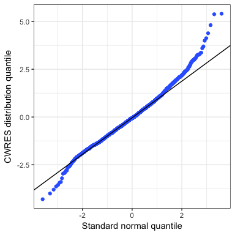

Example
================

-   [Exammple data in the package](#exammple-data-in-the-package)
-   [Observed versus population predicted](#observed-versus-population-predicted)
-   [Observed versus population predicted by renal function](#observed-versus-population-predicted-by-renal-function)
-   [Observed versus population predicted by study (y-axis varies by plot)](#observed-versus-population-predicted-by-study-y-axis-varies-by-plot)
-   [Residuals versus population predictions](#residuals-versus-population-predictions)
-   [Conditional weighted residuals versus population predictions](#conditional-weighted-residuals-versus-population-predictions)
-   [Conditional weighted residuals versus time after dose](#conditional-weighted-residuals-versus-time-after-dose)
-   [Boxplot of ETAs versus categorical covariates](#boxplot-of-etas-versus-categorical-covariates)
-   [Scatterplots of ETAs versus continuous covariates](#scatterplots-of-etas-versus-continuous-covariates)
-   [Boxplot of conditional weighted residuals versus categorical covariates](#boxplot-of-conditional-weighted-residuals-versus-categorical-covariates)
-   [Scatterplots of conditional weighted residuals versus continuous covariates](#scatterplots-of-conditional-weighted-residuals-versus-continuous-covariates)
-   [Scatterplot matrix of ETAs](#scatterplot-matrix-of-etas)
-   [Quantile-quantile plot of conditional weighted residuals](#quantile-quantile-plot-of-conditional-weighted-residuals)

``` r
library(pmplots)
library(dplyr)
library(mrggsave)
```

Exammple data in the package
============================

``` r
obs <- pmplots_data_obs()

id <- distinct(obs, ID, .keep_all=TRUE)

dayx <- defx(breaks = seq(0,168,24))
```

Observed versus population predicted
====================================

``` r
dv_pred(obs)
```



Observed versus population predicted by renal function
======================================================

``` r
dv_pred(obs) + facet_wrap(~RF)
```



Observed versus population predicted by study (y-axis varies by plot)
=====================================================================

``` r
p <- split_plot(obs, sp="STUDYc", fun=dv_pred, what="NoDoze (ng/ml)")
```

``` r
mrggdraw(p, ncol=2, script="test.R", arrange=TRUE)
```



Residuals versus population predictions
=======================================

``` r
res_pred(obs)
```



Conditional weighted residuals versus population predictions
============================================================

``` r
cwres_pred(obs)
```



Conditional weighted residuals versus population predictions with only unusual points labeled with ID \# Residuals and conditional weighted residuals versus time

``` r
cwres_time(obs)
```


``` r
res_time(obs)
```


Conditional weighted residuals versus time after dose
=====================================================

``` r
cwres_tad(obs)
```


Boxplot of ETAs versus categorical covariates
=============================================

``` r
etal <- c("ETA1//ETA-CL", "ETA2//ETA-V2", "ETA3//ETA-KA")
p <- eta_cat(id,
             x="STUDYc//Study",
             y=etal)
```

``` r
mrggdraw(p, ncol=2, arrange=TRUE,script="test.R")
```



Scatterplots of ETAs versus continuous covariates
=================================================

``` r
p <- eta_cont(id,
              x="WT//Weight (kg)",
              y=etal)
```

``` r
mrggdraw(p, ncol=2, arrange=TRUE,script="test.R")
```



Boxplot of conditional weighted residuals versus categorical covariates
=======================================================================

``` r
cwres_cat(obs, x="STUDYc//Study")
```



Scatterplots of conditional weighted residuals versus continuous covariates
===========================================================================

``` r
cwres_cont(obs, "WT//Weight (kg)")
```


Scatterplot matrix of ETAs
==========================

``` r
cols <- paste0("ETA", 1:3)
labs <- paste0("ETA-", c("CL", "V2", "KA"))
GGally::ggpairs(id[,cols],columnLabels=labs)
```



Quantile-quantile plot of conditional weighted residuals
========================================================

``` r
cwres_q(obs)
```


